# Spell Tome PCB

<p align="center">
  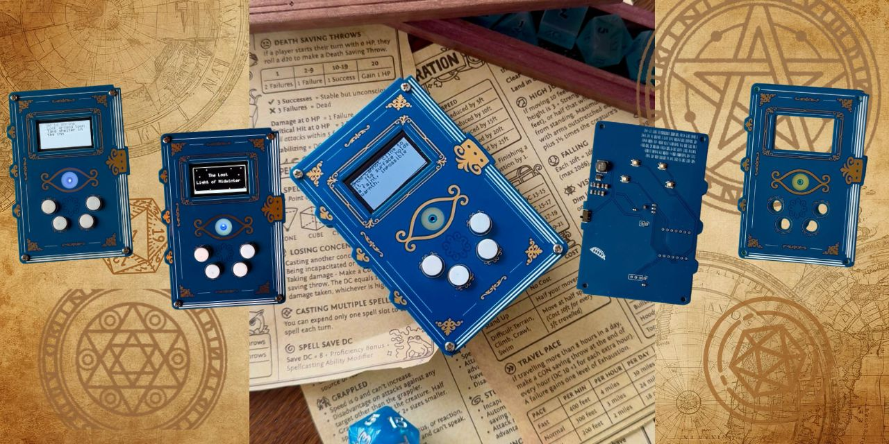
</p>

A handheld fantasy-themed PCB spell tome designed for tabletop RPGs and other shenanigans.

The Spell Tome is a sandwiched, book-like PCB build consisting of
a functional electronics PCB and a decorative top PCB.
Originally it was designed as a magical artifact for a custom text adventure and small games.

Right now it's evolving into anything that can be done with a tiny OLED and 4 buttons (stay tuned!).

---

## Features

- Handheld layered PCB construction
- Decorative top PCB with silkscreen and copper artwork
- Book-label-style OLED display
- RGB status eye staring at your soul
- Push buttons
- Powered by 2x AAA batteries
- Designed around the Seeed Studio XIAO RP2040
- Custom firmware for text adventures and other games (currently under cleanup, coming soon)

---

## Gallery

<p align="center">
  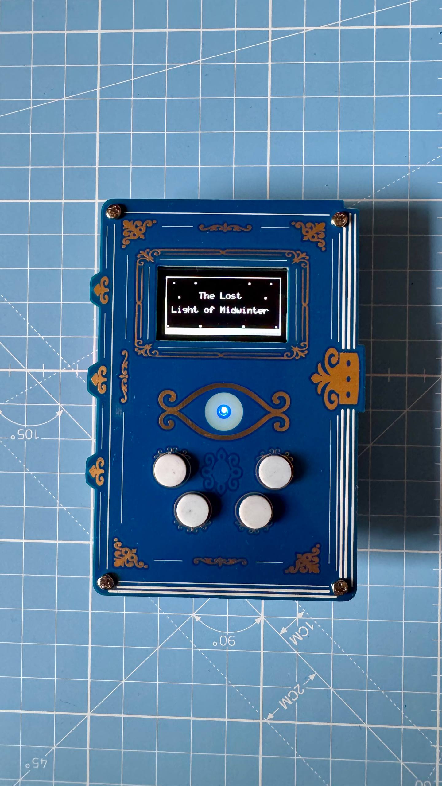
  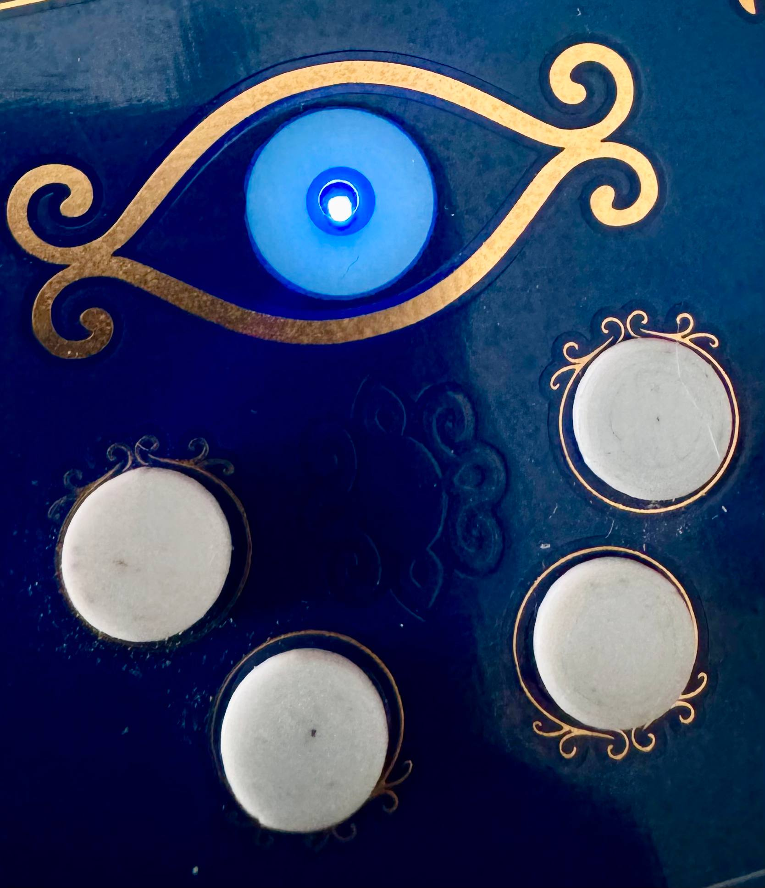
</p>

<p align="center">
  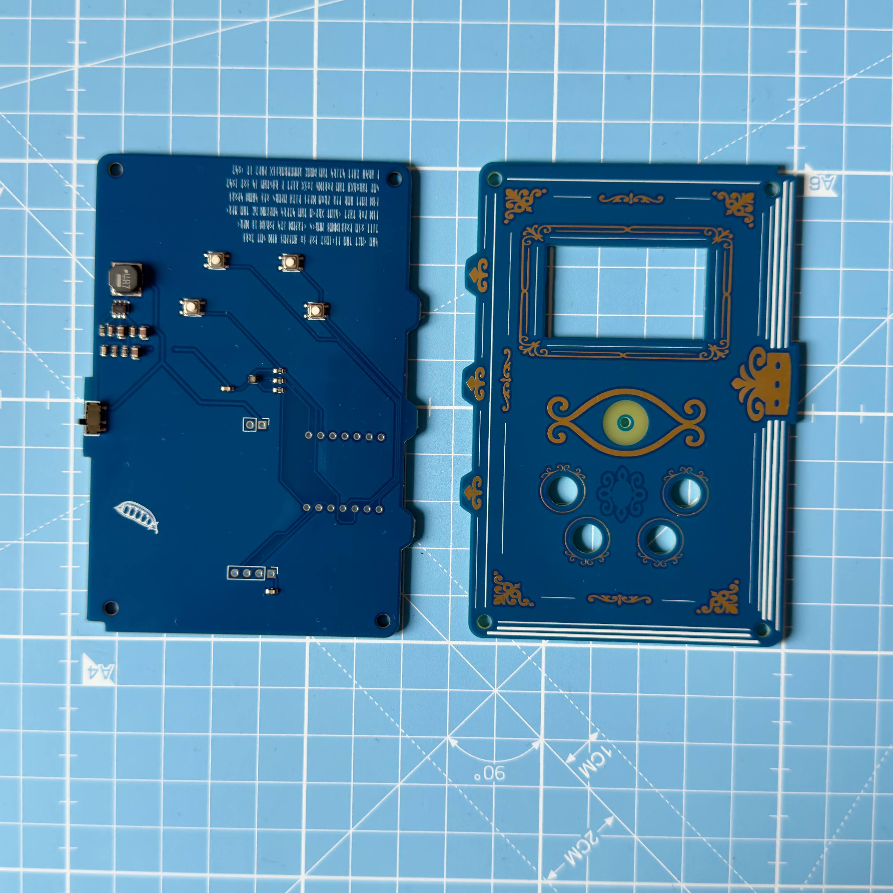
  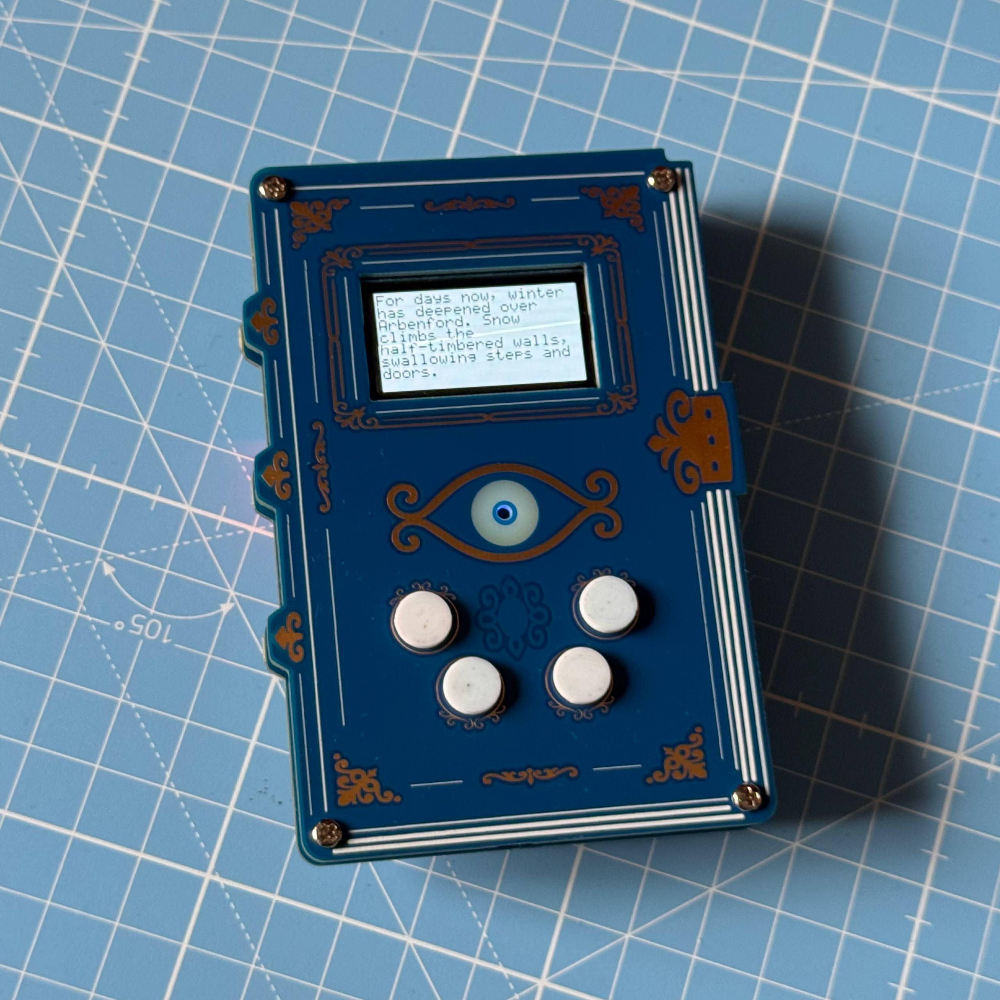
</p>

---

## Hardware Overview

<p align="center">
  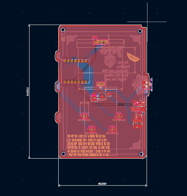
  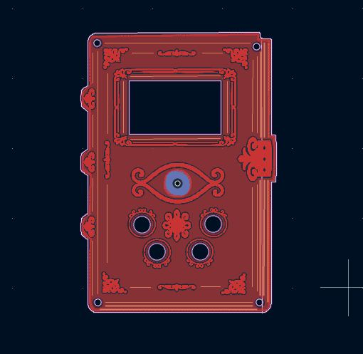
</p>

The Spell Tome is designed around a Seeed Studio XIAO RP2040 to make it easy to customise, reprogram, and repurpose. It consists of two separate PCBs that together form a small handheld device, no additional case needed.

### Bottom PCB

The bottom PCB holds all the electronics, meaning the schematics only refer to the bottom PCB. Buttons and RGB LED parts are flat so that the handheld stays slim overall.

<p align="center">
  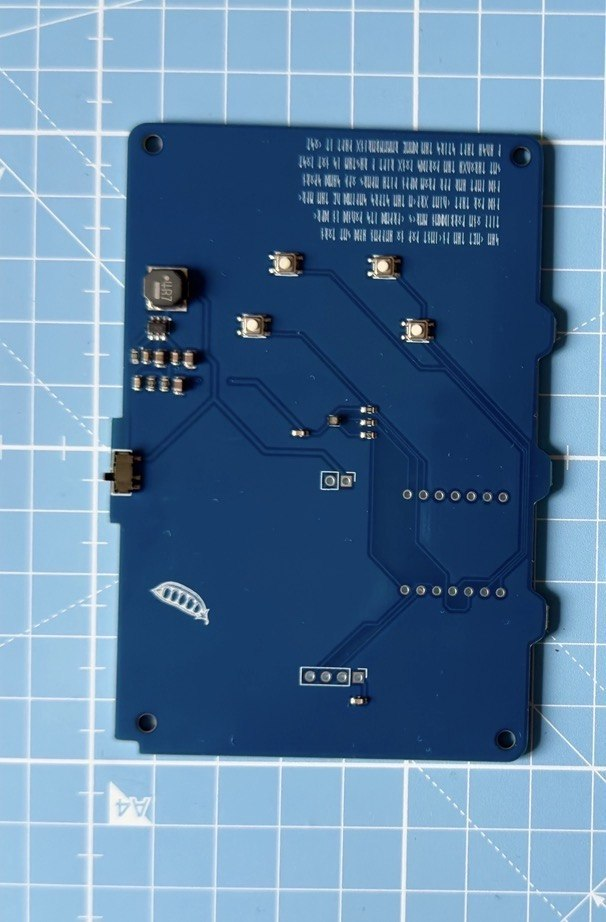
</p>

### Top PCB

The top PCB functions as a decorative cover for the handheld. It has an eye-shaped keepout zone so the status LED's light shines through. Very magic. Much wow.

It also has cutouts for 4 3D printed buttons.

<p align="center">
  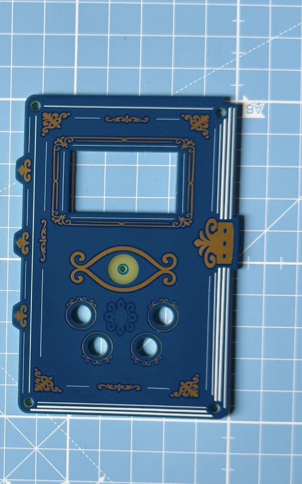
</p>

---

## Main Components

The parts selection is mainly influenced by "I have this at home already" and "I want people to be able to easily assemble and program it":

- Seeed Studio XIAO RP2040 microcontroller
- 1.3" OLED display
- MCP1640 boost converter
- RGB status LED
- 4x tactile push buttons
- Power slide switch
- 2x AAA battery holder
- 4x 3D printed button caps
- 4x spacers and screws (ideally golden, for the vibe)

Of course the project also uses standard components such as
resistors, capacitors, and passive power circuitry. You'll find them and their respective values in the BOM files in:

```text
fabrication/bom/
```

---

## Assembly


<p align="center">
  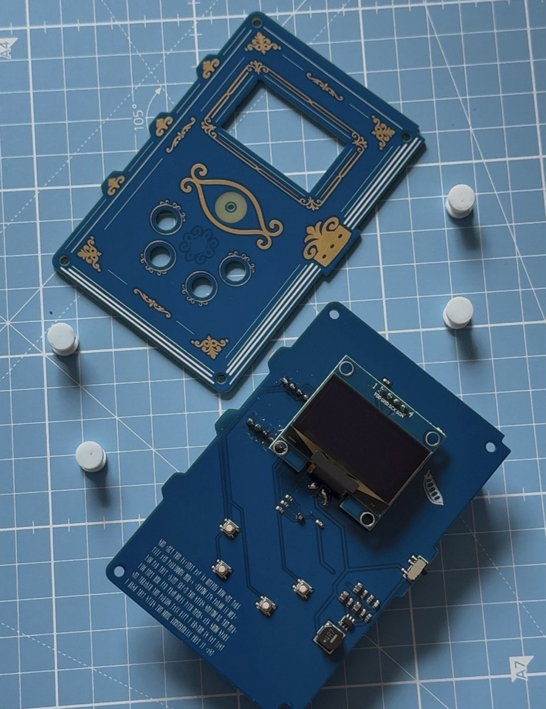
</p>

### PCB Stackup

Since the Spell Tome uses a layered PCB construction, you'll need to fit these parts together:

1. Bottom electronics PCB
2. Printed button elements
3. Decorative top PCB
4. Battery holder

To assemble the Tome you'll need M2.5 screws and spacers/standoffs (6 mm worked well for me here).

Detailed soldering instructions follow.

Assuming you already soldered the parts:

1. Screw the standoff to the bottom PCB (screw on the outward-facing side, standoff inside)
2. Put the button-shaped button parts through the top PCB's holes and secure them with the little 3D printed rings
3. Put the cover on top of the standoffs on the bottom PCB and test the buttons a little to find a good distance before screwing it on (you can also adjust this later with something pointy)
4. Glue the battery holder to the back where it feels comfortable and make sure to secure the wires with a little glue as well

#### Mechanical Button Parts

3D printable parts are available in:

```text
mechanical/
```

Print the buttons without supports.

### Assembly Notes

- you can find golden screws that pass the vibe check if you look for jewellery screws
- I printed the buttons in white PLA, but it's probably more comfy to use TPU and prettier with something shiny
- depending on how thick you want that thing to be, you can also use longer standoffs and put the batteries between the sandwich layers

---

## Repository Structure

```text
spell_tome/
├── artwork/        # Source artwork and SVG files
├── fabrication/    # BOMs and fabrication outputs
├── libraries/      # Local KiCad symbol and footprint libraries
├── mechanical/     # 3D printable parts
├── pics/           # Images and renders
├── *.kicad_*       # Main KiCad project files
└── README.md
```

---

## Firmware

Firmware was hacked together in one long weekend and is currently under cleanup (guess "a little messy" is fine for personal projects, "wtf even is that" is not ;)) and will be published in this repo soon.

Features:
- the cringiest text adventure you'll ever play
- impractical mini games
- the mysterious blood moon side quest

---

## Fabrication

Gerbers and manufacturing files can be generated directly from the KiCad project files. The current Gerbers are the tested and working version.

Please make sure to regenerate them before sending something to fabrication, I cannot be trusted to remember to do this after every change I make.

Pre-generated fabrication outputs belong and are available in:

```text
fabrication/gerbers/
```

---

## Color inspo

<p align="center">
  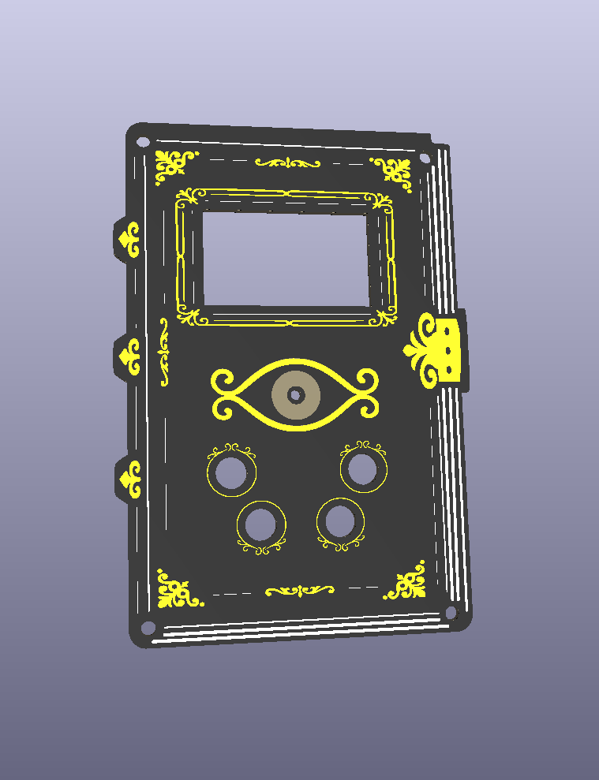
  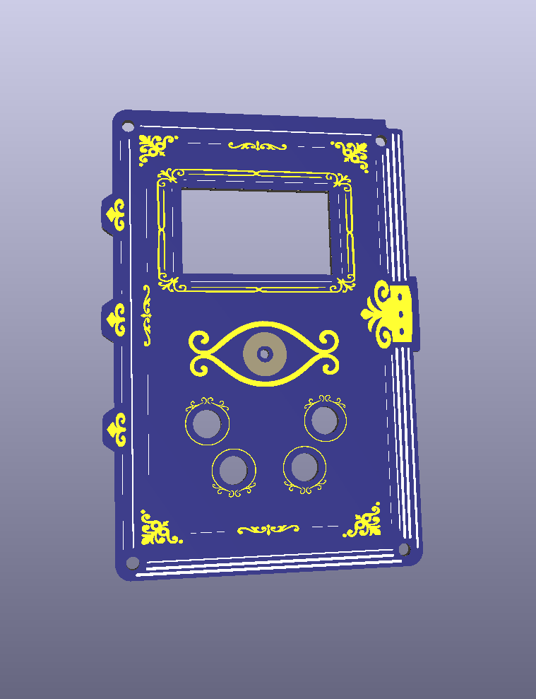
  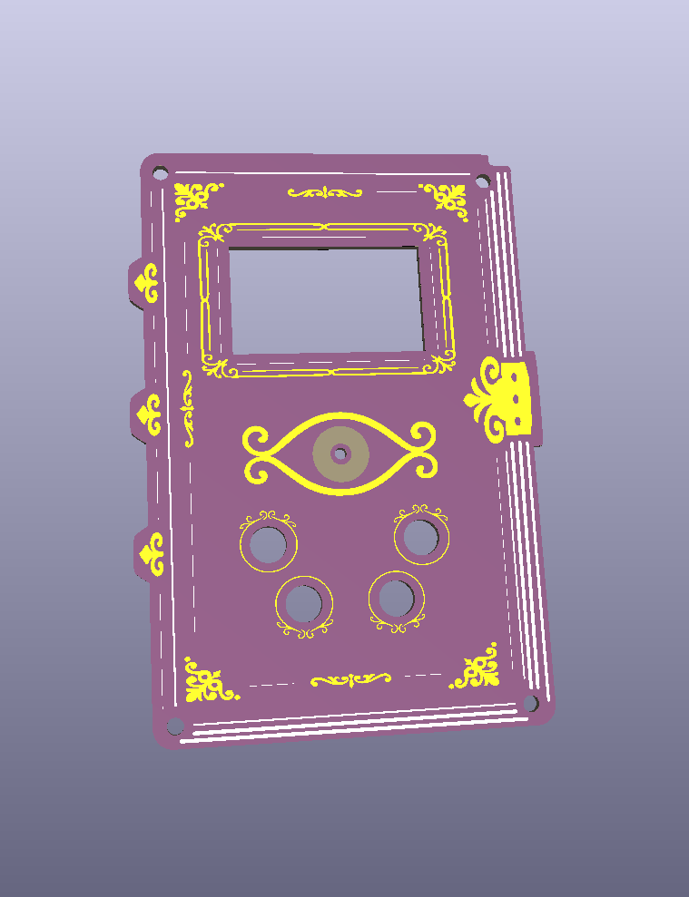
  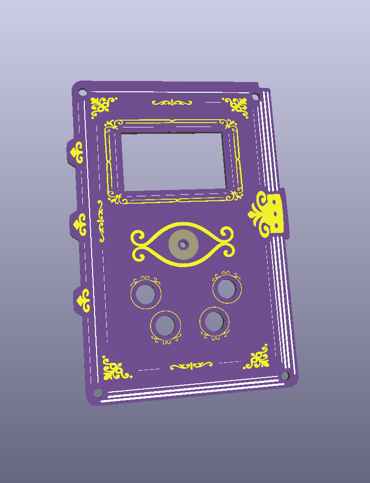
</p>

## Further Reading
- [Hackster: This Open Source RP2040 Development Board Looks Like a Magic Spellbook](https://www.hackster.io/news/this-open-source-rp2040-development-board-looks-like-a-magic-spellbook-52a614f74b81)

## License

Hardware design files are licensed under the CERN Open Hardware Licence
Version 2 - Strongly Reciprocal (CERN-OHL-S-2.0).

See the `LICENSE` file for details.

Copyright (c) 2026 miss.molerat
